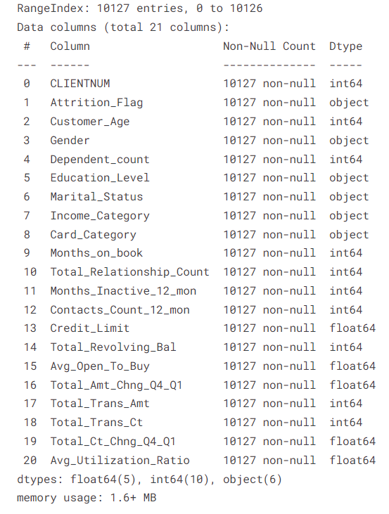
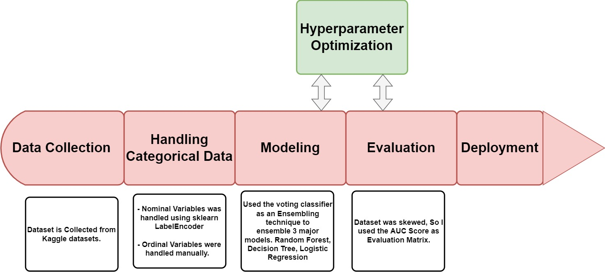
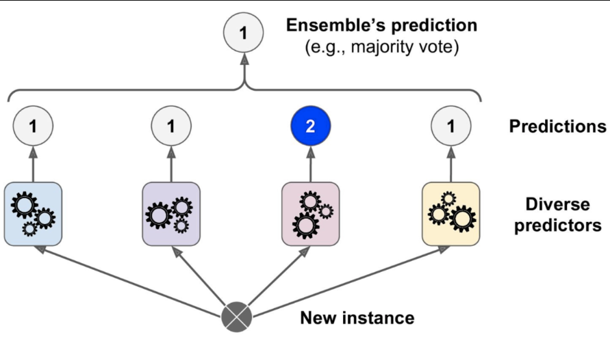
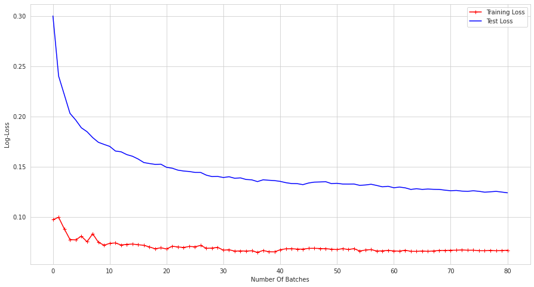
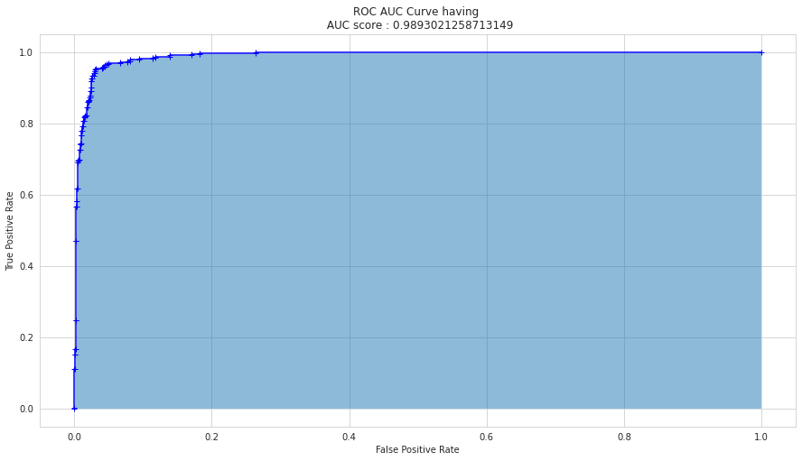

# Bank Churn Prediction

Bank Churn is a Machine learning Project in which the task is to predict who wants to leave credit card services. So that he or she can proactively go to the customer to provide them better services and turn the customer's decisions in the opposite direction. 

 

## Table of Content

* [About The Project](#1)
* [About Data](#2)
* [Methodology](#3)
* [Results](#4)
* [Deployment](#5)
* [Reference](#6)

## About the Project 

The process involves applying for a credit card, getting approved, meeting a minimum spend within a set amount of time, earning a large welcome bonus, and canceling the card before the next annual fee is due. Once this is complete, the process is simply repeated again and again, hence the term churning. In this project using a dataset related to bank churn I predicted the churn.   

## About the Data 

A manager at the bank is disturbed with more and more customers leaving their credit card services. They would really appreciate if one could predict for them who is gonna get churned so they can proactively go to the customer to provide them better services and turn customers' decisions in the opposite direction

Now, this dataset consists of 10,000 customers mentioning their age, salary, marital_status, credit card limit, credit card category, etc. There are nearly 18 features.

We have only 16.07% of customers who have churned. Thus, it's a bit difficult to train our model to predict churning customers.

Note few points 

- The dataset is imbalanced.
- Most features are categorical (Nominal, Ordinal, Binary), some with high cardinality.

To overcome the above challenges various approaches were used(see the notebook for more deep understanding). 

## Methodology 

For the detail Understanding of the methodology please visit the notebook present in the master repository. 

### Model Architecture

A collection of several models working together on a single set is called an ensemble. The method is called Ensemble Learning. It is much more useful use all different models rather than any one.

## Results 

### Learning Curve

It Help us determine if model is overfitting or underfitting.

### AUC Curve

Evaluation Results of the model.

## Deployment 

## Reference 

1. [Learning Curves](https://www.kaggle.com/nkitgupta/who-will-leave-a-job)

2. [ROC AUC Curves](https://www.kaggle.com/nkitgupta/who-will-leave-a-job)

3. [Evaluation Metrics](https://www.kaggle.com/nkitgupta/who-will-leave-a-job)

4. [XGB Classifier](https://mran.microsoft.com/web/packages/xgboost/vignettes/xgboost.pdf)

5. [Hard Voting versus Soft Voting](https://stats.stackexchange.com/questions/320156/hard-voting-versus-soft-voting-in-ensemble-based-methods)

6. [Why Normalization is not required for tree based models](https://www.kaggle.com/c/m5-forecasting-accuracy/discussion/160613)

7. [Kaggle notebook for Categorical Encoding Methods](https://www.kaggle.com/arashnic/an-overview-of-categorical-encoding-methods)

8. [How to Implement Bayesian Optimization from Scratch in Python](https://machinelearningmastery.com/what-is-bayesian-optimization/)
